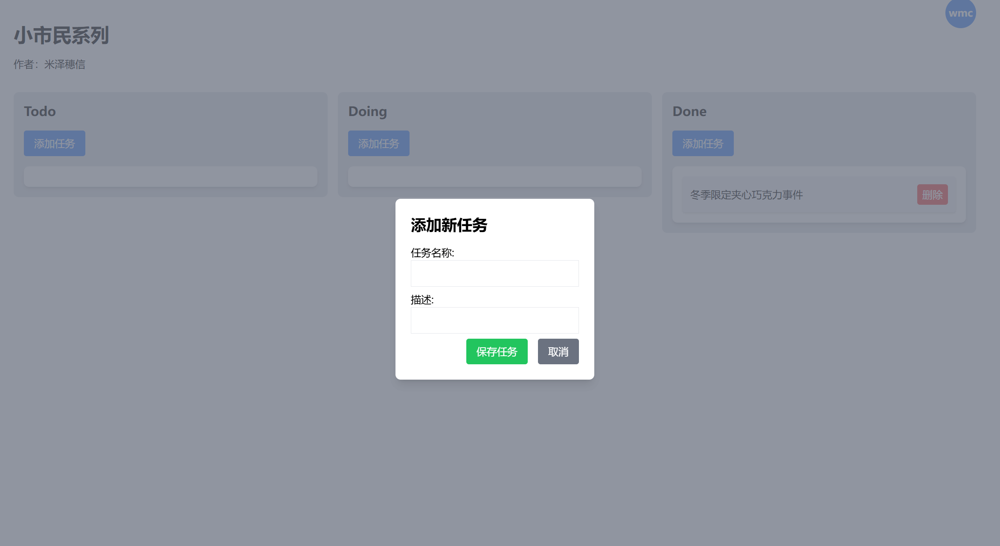

## 任物语

仓库地址：https://github.com/araraki-koyomin/NJU-24su-Webproj

### 1. 项目简介

*此项目是南京大学2024暑校**Web开发**的大作业。*

这是一个**敏捷看板**项目，旨在帮助用户管理自己的工作/学习进度

### 2. 项目功能

#### 2.1  注册账号

用户可在注册界面输入自己设定的*用户名*和*密码*，注册属于自己的账号。

支持注册多个账号。


#### 2.2 多用户登录

用户可在登陆界面输入自己的账号信息进行登录。

支持登录已注册的不同账号。


#### 2.3 项目展示

用户可在项目列表界面看到所有创建的项目，包括项目的名称、描述、创建时间、状态等信息


#### 2.4 项目查找

用户可根据项目名称片段筛选项目

#### 2.5 新建项目

用户可新建项目并为其命名、描述


#### 2.6 查看项目具体信息

用户点击项目名称后，可进入项目具体展示页面，内容包括项目名称等信息以及任务列表。任务按照$Todo, Doing, Done$分为3类，可分别在这三栏下创建任务


#### 2.7 新建任务



#### 2.8 查看任务具体信息

点击任务名，可查看对应任务的具体信息，包括名称、种类、描述、评论、附件


#### 2.9 编辑任务信息

可编辑任务描述、改变任务分类

#### 2.10 为任务添加评论


#### 2.11 为任务添加附件/下载附件

可从本机上传不超过100MB的文件。点击下载可将附件下载到本地。

### 3. 技术栈

- 前端：React, Tailwind CSS
- 后端：MidwayJS, Koa
- 持续集成活动：GitHub Actions
- 数据存储：JSON

### 4. 安装步骤

1. 克隆项目仓库

```bash
https://github.com/araraki-koyomin/NJU-24su-Webproj.git
```

2. 解压$webProj.zip$文件
3. 启动webProj文件夹中$start.bat$，在等待5秒后，选择$http://127.0.0.1:4173$端口启动项目

### 5. 注意事项

该项目在运行时应具有$Node.js$运行环境，若不具备，请先配置环境。
